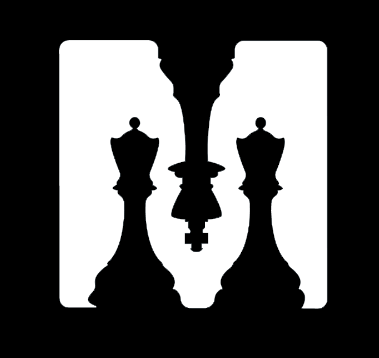

# ♟️	ChessMate
<br />
<br />
<div align="center">
    
    <h3 align="center"> Android application for playing chess  in single player and multiplayer. </h3>
    <h5 align="center">Uses a deep neural network to scan an image containing a chess board and starts a game with the pieces in the same position as the image</h5>
</div>

# 🏆 Our team:
```
Andrea Panceri, matricola: 1884749

Francesco Sudoso, matricola: 1808353
```
## 🛰️ Micro-Service

The flask micro-service can be reached here <a href="https://github.com/Awenega/ChessMate-MicroService-MACC">Link</a>

## 📖 Presentation

The report can be reached through this <a href="https://docs.google.com/presentation/d/14m4oKUa0NtrDsfDYBSc2E8W-CHii6r46UYwr1hnUr1E/edit?usp=sharing">Link</a>


